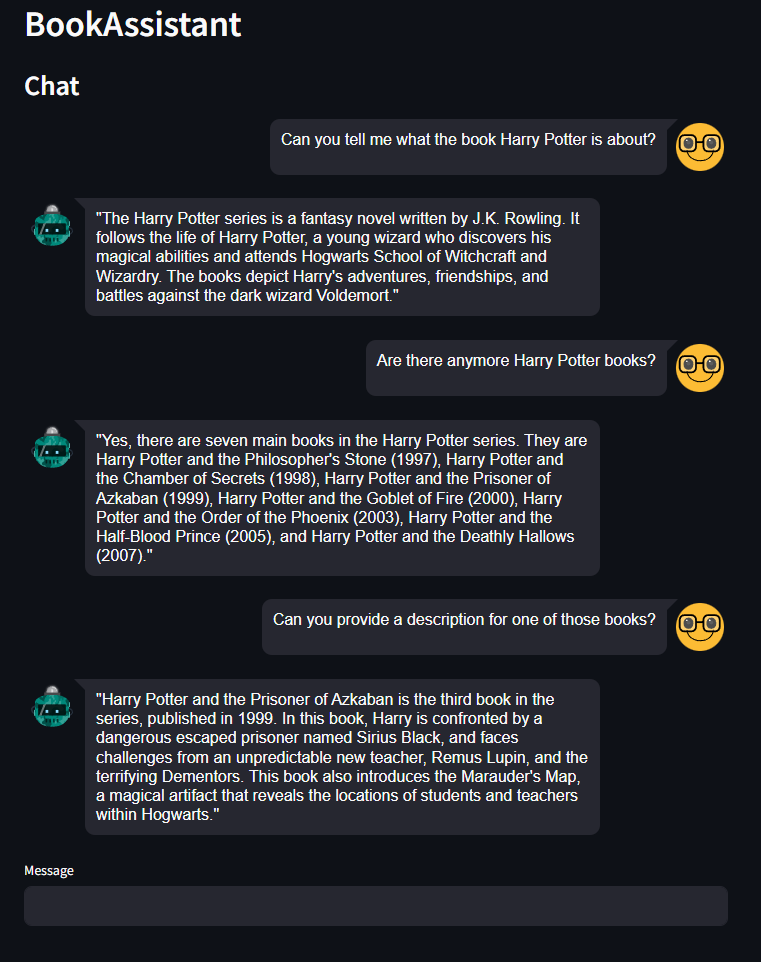

# BookAssistant
BookAssistant is your ultimate tool to navigate through a vast collection of over 1 million books and find the perfect read tailored to your needs and preferences. Whether you're looking for a specific genre, author, or topic, BookAssistant is here to help.
## Key Features
* Vast Library: Search and discover books from a collection of over 1 million titles.
* Powered by Ollama: Utilize the advanced capabilities of the LLM server Ollama to enhance your search experience and get personalized recommendations.
* Chroma Vector Database: All book data is stored in a high-performance chroma vector database, ensuring fast and accurate search results.
* Session Memory: BookAssistant can remember your queries and interactions within the current session, making it easier to refine your search and explore new suggestions.
## Conversation with BookAssistant

    

## Dataset
https://www.kaggle.com/datasets/sp1thas/book-depository-dataset?select=dataset.csv